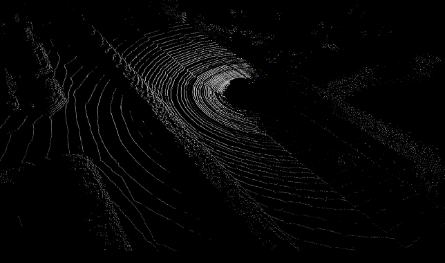
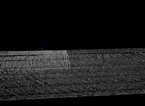
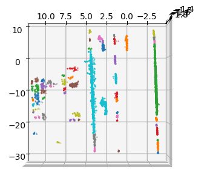
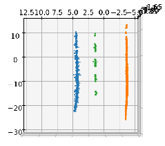

# lidar_lane_py
3d lidar point cloud lane detection with python and vispy


  


 

## Contents
1. [Setup](#setup)
2. [Dataset](#dataset)

## Setup
Install anaconda
```Shell
wget https://repo.anaconda.com/archive/Anaconda3-2020.11-Linux-x86_64.sh
bash Anaconda3-2020.11-Linux-x86_64.sh
source ~/.profile
```

Clone the repo and build the environment

```Shell
git clone https://github.com/hojun-Ch/lidar_lane_py.git
cd lidar_lane_py
conda create -n llpy python=3.7
pip3 install -r requirements.txt
conda activate llpy
```
